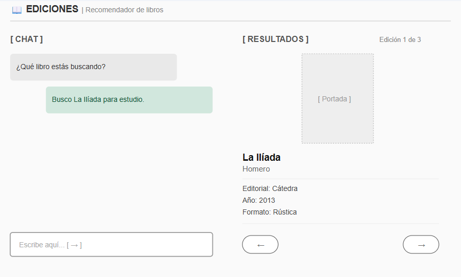
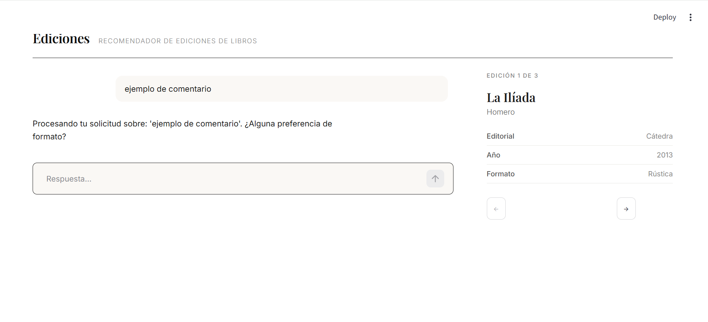

# Diseño Frontal

## 1. Resumen de la Solución y del Usuario
Este proyecto tiene como finalidad ayudar a decidir que edición es la que mejor se adapta a una serie de necesidades/características dadas. El usuario que esté en proceso de comprar un libro compartirá con un agente el título u obra que busca junto con una serie de especificaciones que acoten la búsqueda y permitan definir su perfil, de modo que se le presenten las 3 ediciones más cercanas a lo que busca de entre todas las posibilidades.

El producto final será una web diseñada con streamlit que contará con un chatbot mediante el cual mantener una canversación con el agente y una columna de deslizables con los resultados del modelo: título, portada, editorial, año de publicación y precio. El agente proporcionará, además, un mensaje en el chat que explique el porqué de cada decisión.

## 2. Mockup
La idea inicial es que la aplicación permita al usuario expresar sus necesidades y recibir los resultados del modelo. Para ello, estará dividida en dos columnas, una para cada finalidad, similar al siguiente esquema:

****

Una primera versión (`app2.py`) se vería así:

## 3. Justificación del Diseño

El diseño propuesto está pensado para que el usuario tenga acceso directo tanto a la entrada como a la salida del modelo, todo en la misma pantalla. Esto le permite poder revisar, corregir o añadir información a su petición simplemente escribiendo un nuevo mensaje al agente, pues él mismo será el encargado de reunir la información necesaria para filtrar y preparar los datos que posteriormente usará el modelo, simplificando considerablemente el uso de la aplicación.  

Una vez obtenido el top 3, se presentará de forma directa al usuario la información mínima relevante para identificar una edición (título, autor, editorial, fecha, portada) en el panel deslizable de la derecha, mientras que otros aspectos relevantes, ya sean de metadatos o del ranking, serán analizados y compartidos por el agente mediante el chat para facilitar la comprensión de los resultados y ayudar a tomar la decisión final.

Puesto que el chat es la principal herramienta de interacción con la que cuenta el usuario, este debe resaltar con respecto a los demás paneles y su información debe ser facilmente accesible y manejable. Los resultados del ranking aparecerán en una columna ligeramente más pequeña priorizando la imagen de la portada por ser la forma más directa y simple de identificar la edición.

## 4. Presentación de Resultados y Explicabilidad

Como se ha mencionado anteriormente los resultados se mostrarán en dos partes:

* Un panel deslizable con el top 3 ediciones resultado del modelo acompañadas de información básica de las mismas.

* Una interpretación adicional del agente que compare el rigor del aparato crítico (notas/estudios), prestigio de la traducción/editorial, tipo de encuadernación o precio. El usuario puede hacerse una idea clara de cuáles son las particularidades de la opción mostrada frente a las demás alternativas del dataset.

Los resultados no se presentan como opciones absolutas, sino como la edición que mejor se ajusta a las restricciones propuestas, de ahí que se permita al usuario modificar las condiciones iniciales hasta llegar a un resultado que le convenza.

## 5. Alcance del MVP

La aplicación contará con un frontal totalmente funcional en Streamlit (Python) apoyado por CSS personalizado. Estará implementado de forma operativa el flujo conversacional del chat mediante st.chat_input y el panel de resultados, el cual actualiza las fichas de los libros y su navegación (← / →) en tiempo real. La capa explicativa de IA generativa se integrará alternativamente mediante API (Google Gemini) y Ollama (para pruebas en ámbito local) con prompts acotados a los datos.

La prioridad de esta versión inicial se centra en garantizar la estabilidad del layout responsivo, la correcta ejecución del modelo y la trazabilidad de las explicaciones.
